# Sequence to Sequence (seq2seq) Learning with Neural Networks

## Translation

Translate (finite) sequence of tokens $x\equiv(x_1, \ldots, x_{T_x})$ to another sequence $y \equiv (y_1, \ldots, y_{T_y})$:

```python
x_tokens = ['I', 'hope', 'I', 'get', 'a', 'big', 'bonus', 'next', 'year', EOS]
y_tokens = ['J\'espère', 'avoir', 'un', 'gros', 'bonus', 'l\'année', 'prochaine', EOS]
```

```python
x = Embed(x_token) for x_token in x_tokens]
y = Embed(y_token) for y_token in y_tokens]
```

## Review: gated recurrent unit (GRU)


## A simple seq2seq model

- Generate a hidden (a.k.a. latent) state $h_t$ for the inputs per

$$
h_t = \operatorname{GRU}_\theta(x_t, h_{t - 1})
$$

- Generate a hidden state $s_t$ for the outputs per

$$
s_t = \operatorname{GRU}_\phi(y_{t - 1}, s_{t - 1})
$$

- Model the conditional probability of the next word as

$$
\mathbb{P}(y_t = w_i \mid x, y_1, \ldots, y_{t - 1}) = [\operatorname{SoftMax} \circ \operatorname{Linear}_\psi(s_t)]_i
$$

## A simple seq2seq model

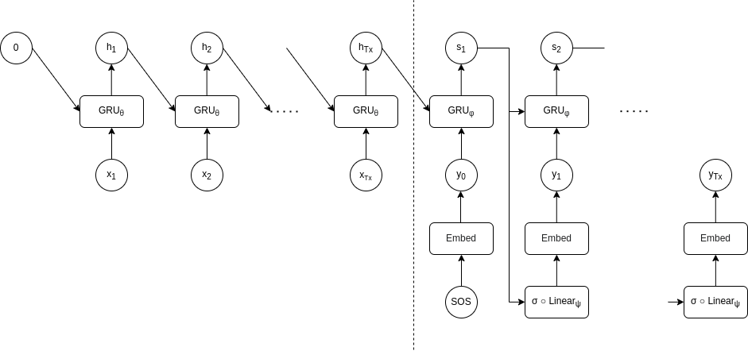

## Problem

- Encoder needs to compress entire input sentence into fixed length vector $h_{T_x}$

- Makes it difficult to work with long sentences (especially ones longer than in training corpus)

# Neural Machine Translation by Jointly Learning to Align and Translate

## Long sentences

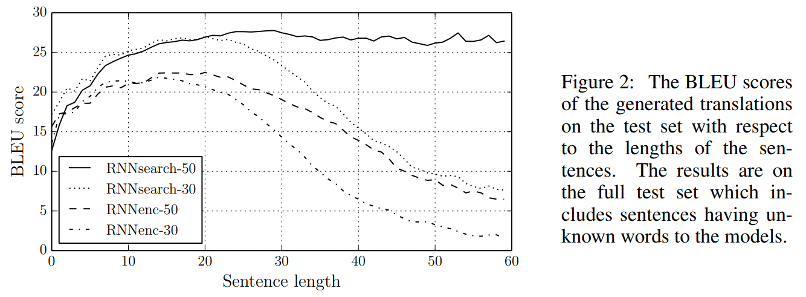

## Attention

- In seq2seq, all hidden states $h_j$ save for last ($h_{T_x}$) are discarded

- Think of this as creating a trivial context $c = \sum_j \alpha_j h_j$ where $\alpha_j = \delta_{j, T_x}$

- If we allow $\alpha$ to be a probability vector, we obtain a context in which the amount of "*attention*" paid to latent state $h_j$ is $\alpha_j$

- Since the encoder/decoder is typically made up of recurrent units (e.g., GRU or LSTM), we expect the latent states to be "forgetful" (e.g., the latent state $h_j$ in the seq2seq example is more influenced by nearby words $x_j$ or $x_{j - 1}$ than words that are far away)

- Therefore, we can think of $\alpha_j$ as the amount of attention paid to input word $x_j$

- Moreover, we can use a separate context $c_i = \sum_j \alpha_{ij} h_j$ per output word $y_i$

## Attention

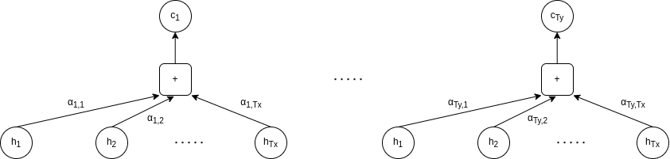

## Alignment model

- How do we know what to pay attention to?

- Use a *common* "alignment model":
  
  $$
  e_{ij} = \operatorname{MultilayerPerceptron}_\eta \circ \operatorname{Concatenate} (s_{i - 1}, h_j)
  $$
  
  $$
  \alpha_i = \operatorname{SoftMax}(e_i)
  $$

- In particular, $\eta$ is learned end-to-end

## Bidirectional RNN (BiRNN)

- If we use an RNN like in the seq2seq example, the encoding $h_j$ will depend only on words $x_1, \ldots, x_j$

- Think about how you translate: when you try to make sense of a word in the input, do you *just* use previous words as context? No!

- Use a BiRNN instead

- For example...
  
  - Units $\operatorname{GRU}_{\overrightarrow{\theta}}$ that read the input from left to right ($x_1, \ldots, x_{T_x}$) and generate forward hidden states $\overrightarrow{h}_1, \ldots, \overrightarrow{h}_{T_x}$
  
  - Units $\operatorname{GRU}_{\overleftarrow{\theta}}$ that read the input from right to left ($x_{T_x}, \ldots, x_1$) and generate backward hidden states $\overleftarrow{h}_{T_x}, \ldots, \overleftarrow{h}_1$

- Obtain the final hidden state as $h_j = \operatorname{Concatenate}(\overrightarrow{h}_j, \overleftarrow{h}_j)$

## Complete architecture

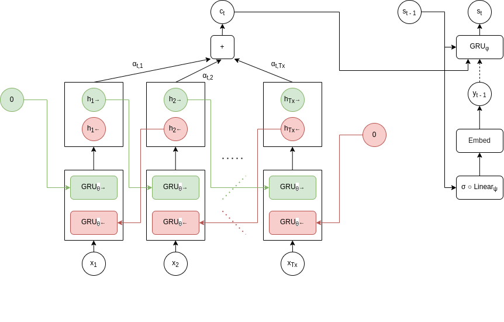

# Attention is All You Need

## Headline result

- We can dispense with the (Bi)RNN and use *only* attention to images dependencies between input and output

- Authors propose the **transformer**, an encoder-decoder pair where both encoder and decoder are stacks consisting of attention and multilayer perceptrons

- Backbone of modern transformer architectures like GPT and BERT

- RNNs are harder to train (inherently sequential) while transformers are not and can leverage GPUs/TPUs

## Self-attention

- Previously, we determined which input word $x_j$ the output word $y_i$ should attend to (by computing the alignment between the hidden states $s_{i - 1}$ and $h_j$)

- In the transformer formulation, words in the *input* attend to each other

- This is called self-attention

- A trivial example of self-attention is obtained by cosine similarity (assume embeddings are unit vectors)
  
  - Similar words attend to one another
  
  - Not useful since parameters are not learned

$$
e_{ij} = x_i^\intercal x_j \qquad \alpha_i = \operatorname{SoftMax}(e_i) \qquad c_i = \sum_j \alpha_{ij} x_j
$$

## Scaled dot-product attention

- Consider three (learnable) matrices ${\color{red} W_Q}, {\color{ForestGreen} W_K}, {\color{blue} W_V} \in \mathbb{R}^{d \times d_0}$

- We transform each word embedding $x_i$ by these matrices to obtain ${\color{red} q_i^\intercal} = x_i^\intercal {\color{red} W_Q}$, ${\color{ForestGreen} k_i}^\intercal = x_i^\intercal {\color{ForestGreen} W_K}$, and ${\color{blue} v_i}^\intercal = x_i^\intercal {\color{blue} W_V}$

- The $q_i$ are called **queries**, the $k_i$ are called **keys**, and the $v_i$ are called **values**
  
  - The query is the attendee
  
  - The keys are the attended
  
  - The values are used to build the context
  
  - Nomenclature comes from information retrieval

$$
e_{ij} = {\color{red} q_i}^\intercal {\color{ForestGreen} k_j} \qquad \alpha_i = \operatorname{ScaledSoftMax}(e_i) \qquad c_i = \sum_j \alpha_{ij} {\color{blue} v_j}
$$

## Scaling

- Suppose $q_i$ and $k_j$ are independent standard normal (i.e., isotropic) random vectors

- Then, $\operatorname{Var}(q_i^\intercal k_j) = d_0$

- Therefore, scale the soft max to prevent ending up in regions with vanishing gradient:

$$
\operatorname{ScaledSoftMax} = \frac{1}{\sqrt{d_0}} \operatorname{SoftMax}
$$

## Matrix form

$$
\operatorname{ScaledSoftMax}[%
    X {\color{red} W_Q} ({\color{ForestGreen} W_K} X)^\intercal%
] X {\color{blue} W_V}
= \operatorname{ScaledSoftMax}[%
    {\color{red} Q} {\color{ForestGreen} K}^\intercal%
] {\color{blue} V}
$$

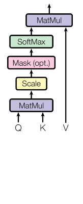

## Multi-head (a.k.a. multi-channel) attention

- Learn multiple attention mechanisms $W^{(\ell)} \equiv (W_Q^{(\ell)}, W_K^{(\ell)}, W_V^{(\ell)})$ for $\ell = 1, \ldots, L$

- Each triplet produces a $T \times d_0$ context; concatenate to get a $T \times d_0 L$ context

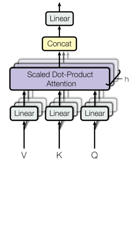

## Multi-head attention example

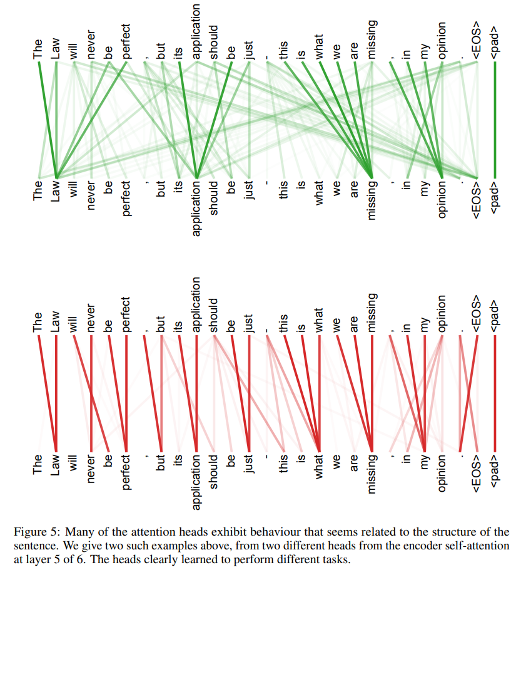

## Complete architecture

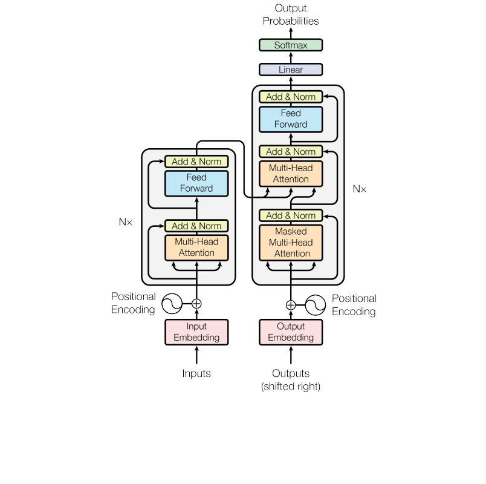

## Repeated layers

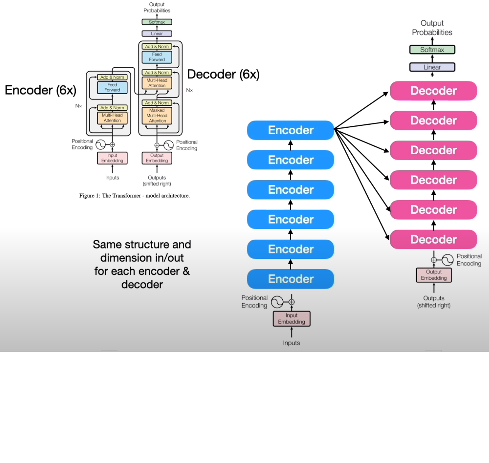

## Masking

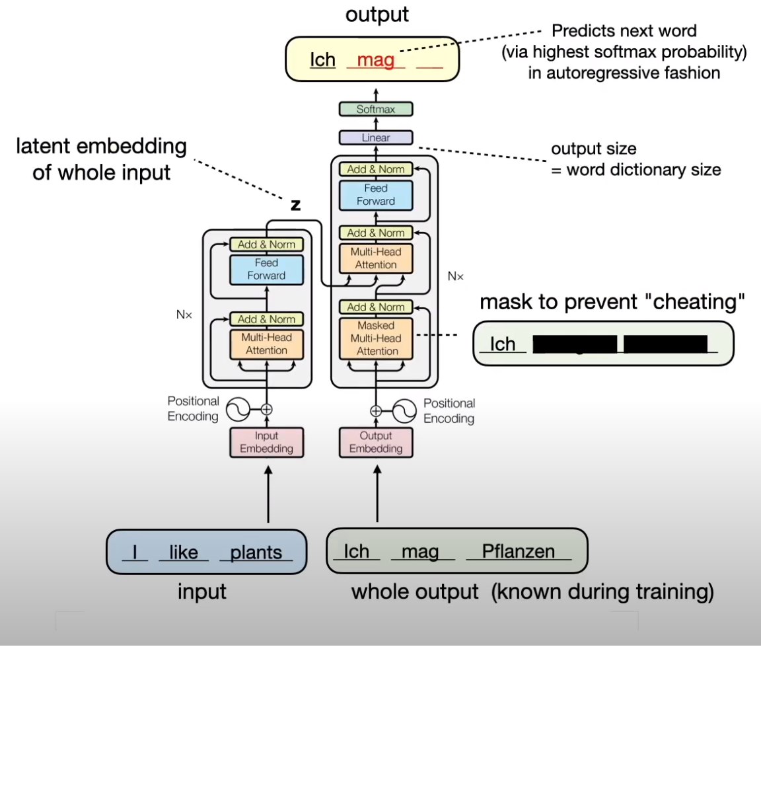

## Loss

- Similar to other applications, learning is by cross-entropy

- Evaluating the transformer yields a $T \times N$ Markov (a.k.a. stochastic) matrix

## Positional encoding

- Unlike RNN models, there isn't a natural notion of word order
- Include positional embedding

$$
\text{PositionalEncoding}_{\text{pos}, 2i \phantom{+ 1}}     = \sin\biggr(\frac{\text{pos}}{10000^{2 i / d}} \biggr)
$$

$$
\text{PositionalEncoding}_{\text{pos}, 2i + 1} = \cos\biggr(\frac{\text{pos}}{10000^{2 i / d}} \biggr)
$$

# Improving Language Understanding by Generative Pre-Training (GPT-v1)

## Architecture and fine-tuning

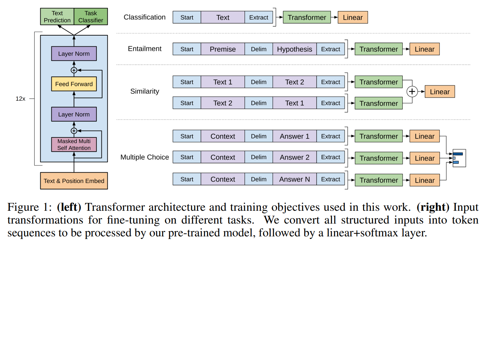

## High-level summary

- GPT-v1 is "self-supervised"
  
  - No need for human labels
  
  - Just feed it a large corpus of data

- GPT-v1 is unidirectional
  
  - Next-word prediction for pre-training
    
    - Each token can only attend to previous tokens in self-attention layers
    
    - Bad for tasks where context is needed from both directions

# BERT: Pre-training of Deep Bidirectional Transformers for Language Understanding

## Idea

- Keep the good things about GPT-v1
  
  - Self-supervision
    
    - BooksCorpus (800M words)
    
    - Wikipedia (2.5B words)
  
  - Transformer architecture

- Introduce better pre-training tasks
  
  - Masked language model ("Cloze")
    
    - Randomly mask some tokens from the input
    
    - Predict masked words based on context
    
    - Unlike next-word prediction, allows for bidirectional learning
  
  - Next-sentence prediction

## Input

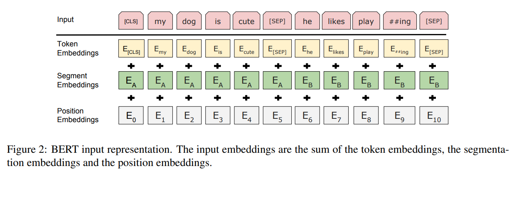

## Masked language model

- Mark 15% of the words in the corpus
  
  - Replace 80% of these with **&lt;MASK&gt;** 
  
  - Replace 10% of these with a random word from the corpus
  
  - Leave the remaining words as is

- Example
  
  - The quick brown **&lt;MASK&gt;** jumps over the lazy dog
  
  - The quick brown **coffee** jumps over the lazy dog
  
  - The quick brown **fox** jumps over the lazy dog

## Next-sentence prediction

- Example:
  
  - &lt;CLS&gt; the man went to &lt;MASK&gt; store &lt;SEP&gt; he bought a gallon &lt;MASK&gt; milk &lt;SEP&gt;
    
    - Label = IsNext
  
  - &lt;CLS&gt; the man went to &lt;MASK&gt; store &lt;SEP&gt; penguin &lt;MASK&gt; are flightless birds
    
    - Label = NotNext

## Fine-tuning

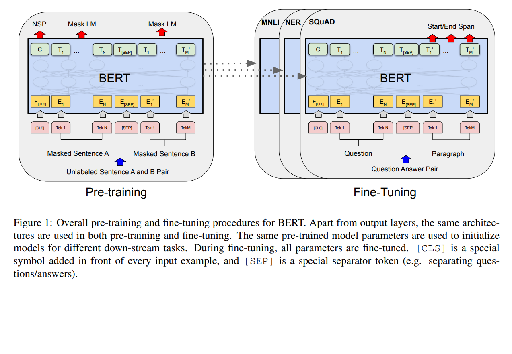

## Embedding approach

- Download a pre-trained BERT model

- Run your features through BERT to generate static embeddings

- Use embeddings as new features in a downstream task

- Advantages
  
  - Fast
  
  - No need to load model into memory
  
  - Can be comparable in accuracy

## Embedding approach

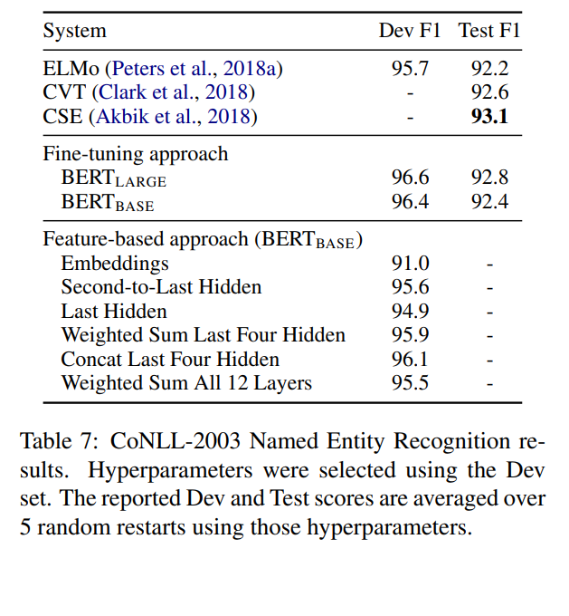

# Supplementary Lectures

- [L19.3 RNNs with an Attention Mechanism - YouTube](https://www.youtube.com/watch?v=mDZil99CtSU)

- [L19.4.1 Using Attention Without the RNN -- A Basic Form of Self-Attention - YouTube](https://www.youtube.com/watch?v=i_pfHD4P_wg)

- [L19.4.2 Self-Attention and Scaled Dot-Product Attention - YouTube](https://www.youtube.com/watch?v=0PjHri8tc1c)

- [L19.4.3 Multi-Head Attention - YouTube](https://www.youtube.com/watch?v=A1eUVxscNq8)

- [L19.5.1 The Transformer Architecture - YouTube](https://www.youtube.com/watch?v=tstbZXNCfLY)

- [L19.5.2.2 GPT-v1: Generative Pre-Trained Transformer - YouTube](https://www.youtube.com/watch?v=LOCzBgSV4tQ)

- [L19.5.2.3 BERT: Bidirectional Encoder Representations from Transformers - YouTube](https://www.youtube.com/watch?v=_BFp4kjSB-I)
